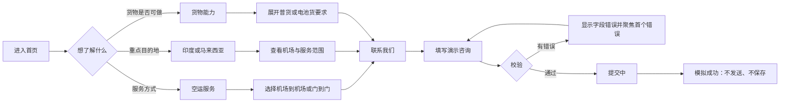
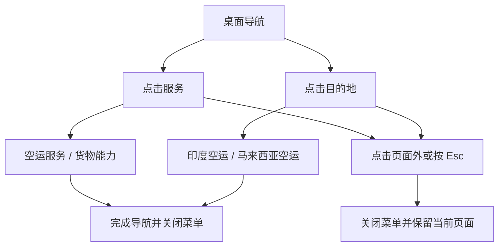

# EVER FLAME LOGISTICS 交互原型说明

## 1. 核心访客流程



主转换目标是让访客从“理解服务”进入“联系业务”。原型不提供下单、报价或追踪捷径，以免形成错误预期。

## 2. 导航流程



### 2.1 桌面导航

- “服务”和“目的地”为 `<button>`，点击切换展开状态。
- 同一时间只展开一个下拉菜单。
- 点击页面外、按 Esc 或点击下拉菜单中的链接后关闭。
- 当前页面的直接链接显示活动状态。
- 所有项目都可通过 Tab 聚焦，无需悬停才能发现。

### 2.2 手机导航

- 入口只显示“Menu / 菜单”；展开后显示“Close / 关闭”。
- 展开菜单占据页头以下的可滚动区域，并临时阻止页面主体滚动。
- 服务与目的地使用分组标题，链接始终可见，不使用隐蔽的二级手势。
- 点击任意链接后自动关闭菜单。

## 3. 语言切换


- 不读取浏览器首选语言，不自动跳转。
- 从 `/india-air-freight` 切换到 `/zh/india-air-freight`，其他页面遵循相同规则。
- 404 页的语言切换回对应语言首页，避免构造未知路径。

## 4. 服务模式切换

- 控件使用 `tablist`、`tab` 和 `tabpanel` 语义。
- 默认选中“机场到机场”。
- 点击或触摸标签后更新选中状态、重点说明、要点和图片。
- 键盘支持：左右/上下方向键循环切换，Home 到第一项，End 到最后一项。
- 完整服务链位于标签面板下方，不因切换而隐藏。

| 状态 | 表现 |
| --- | --- |
| 默认 | 第一项选中，深色文字与橙色下边线。 |
| 悬停 | 文字对比增强，保留标签布局。 |
| 焦点 | 显示高对比橙色焦点框。 |
| 选中 | `aria-selected=true`，对应面板可见。 |
| 未选中 | 可通过 Tab 或方向键到达。 |

## 5. 货物能力展开项

- 普货默认展开，电池/带电产品默认收起。
- 每个标题为独立按钮，通过 `aria-expanded` 公开状态。
- “展开说明 / 收起说明”或“Show details / Hide details”使用明确文字，不依赖加减号图标。
- 两项可同时展开；访客可对照要求。
- 电池货正文及末端提示均强调须按货物、文件、航空公司、航线和目的地确认。

## 6. 联系表单流程

```mermaid
stateDiagram-v2
  [*] --> Default
  Default --> Error: 字段失焦或提交失败
  Error --> Default: 修改为有效内容
  Default --> Submitting: 提交且全部有效
  Submitting --> Success: 700ms 模拟处理完成
  Success --> Default: 重新填写
```

### 6.1 字段与规则

| 字段 | 必填 | 校验 |
| --- | --- | --- |
| 姓名 | 是 | 去除首尾空格后不得为空。 |
| 公司 | 否 | 无额外格式要求。 |
| 邮箱 | 是 | 必填并符合常见邮箱格式。 |
| 微信或 WhatsApp | 否 | 填写时至少 5 个字符，仅允许字母、数字、空格及 `+ - _ . @`。 |
| 起运地 | 是 | 不得为空。 |
| 目的地 | 是 | 不得为空。 |
| 货物与留言 | 是 | 不得为空。 |

### 6.2 状态行为

- 失焦：只显示当前字段错误。
- 提交：检查所有字段；有错误时聚焦第一个无效字段。
- 提交中：按钮文案变化并禁用，防止重复操作。
- 成功：替换为状态面板，明确没有发送或保存数据。
- 重新填写：清空值、错误和触碰状态，恢复默认表单。
- 不发起网络请求，不写入本地存储或 Cookie。

## 7. 桌面与移动端差异

| 模块 | 桌面 | 移动端 |
| --- | --- | --- |
| 页头 | 横向导航与点击下拉 | Menu / Close 全屏文字菜单 |
| 首页首屏 | 文字与图片双栏 | 文字在上、图片在下 |
| 服务交错区 | 50/50 图片文字交错 | 每项文字先读、图片后读 |
| 机场代码 | 8 列 | 2 列；平板为 4 列 |
| 服务流程 | 4 列 | 2×2 |
| 服务标签面板 | 文字与图片双栏 | 单列 |
| 联系页 | 说明侧栏 + 表单双栏 | 纵向排列 |
| 页脚 | 品牌与链接分栏 | 纵向堆叠 |

## 8. 动效

- 链接、按钮和导航反馈约 180ms。
- 内容首次进入视口时淡入并上移 18px，约 520ms，只触发一次。
- 菜单和表单状态不使用复杂过渡，避免阻碍操作。
- `prefers-reduced-motion: reduce` 时取消平滑滚动和可感知动画。

## 9. 原型限制与真实接入点

- `src/content.js` 中的 `companyConfig.contact` 集中管理邮箱、电话、微信和 WhatsApp；当前全部为 `null`。
- 提供真实资料后，应渲染对应渠道按钮并补充验证过的链接或二维码。
- 表单生产接入需要安全后端或表单服务、服务端校验、反滥用、数据保留与权限规则。
- 当前图片为无品牌生成素材；正式照片到位后应保持同样的构图、色调和裁切比例替换。

## 10. 截图索引

- 桌面中英文核心页：`screenshots/desktop/`。
- 移动端首页、服务、联系：`screenshots/mobile/`。
- 手机菜单、表单错误和表单成功：`screenshots/states/`。
